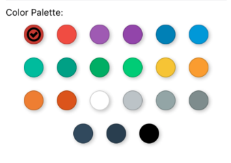

# React Native Color Palette.

A react native module for simple hex color selection



* [x] Controlled and Uncontrolled implementations
* [x] Simple to use


## Getting started
Install the color picker
```
npm install react-native-color-palette --save
```

```javascript
import ColorPalette from 'react-native-color-palette'

const UncontrolledColorPicker = () => (
  <ColorPalette
    onChange={color => alert(`Color selected: ${color}`)}
    defaultColor={'#C0392B'}
    colors={['#C0392B', '#E74C3C', '#9B59B6', '#8E44AD', '#2980B9']}
    title={"Uncontrolled Color Palette:"}
    icon={
      <Text>✔</Text>︎
      // Icon can just be text or ASCII
    }
  />
)

const ControlledColorPicker = () => {
  let selectedColor = '#C0392B';
  return (
    <ColorPalette
      onChange={color => selectedColor = color}
      value={selectedColor}
      colors={['#C0392B', '#E74C3C', '#9B59B6', '#8E44AD', '#2980B9']}
      title={"Controlled Color Palette:"}
      icon={
        <Icon name={'check-circle-o'} size={25} color={'black'} />
      // React-Native-Vector-Icons Example
    }
  />)
}
```
Due to its Flexbox design, Color Palette will use the space you provide!

## API
### Props

Color Palette accepts properties below.

| Property        | Type             | Note                                                                                                                           |
| --------------- | ---------------- | ------------------------------------------------------------------------------------------------------------------------------ |
| `colors`        | `Array`          | Array of hex color strings for rendering. ex) ['#C0392B', '#E74C3C', '#9B59B6', '#8E44AD', '#2980B9']                          |
| `defaultColor`  | `String`         | Defines initial selected color in uncontrolled component.                                                                      |
| `value`         | `String`         | Defines selected color in controlled component.                                                                                |
| `paletteStyles` | `ViewStyle`      | Styles passed to color palette container                                                                                       |
| `onChange`      | `Function`       | Callback with color (HEX string) as argument called when user confirms color selection.                                        |
| `title`         | `String`         | Text to display at the top of the palette.                                                                                     |
| `titleStyles`   | `TextStyle`      | Inherits the default react-native Text Styles                                                                                  |
| `icon`          | `Text` or `Icon` | Selector Text or Icon to be displayed in place of checkmark.                                                                   |
| `scaleToWindow` | `Bool`           | This will automatically scale the palette to fit 6 per line and will scale up/down for iPads/ iPhones depending on window size |
